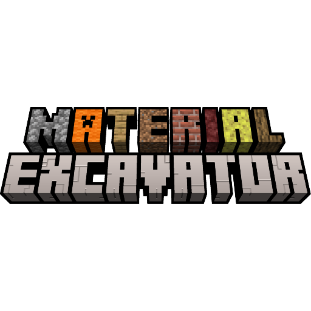

<table style="margin: 0 auto;">
	<tbody>
		<tr>
			<td width="280px" style="text-align: center; width: 280px;"></td>		
			<td>
				<h2 style="text-align: left;">Material Excavator</h2>
				
				
Simple Minecraft beta 1.7.3 mod (for StAPI) that allows you to dig several blocks at once

			</td>		
		</tr>
	</tbody>
</table>

**Features:**
- Works on both server and client
- Key to toggle multiple block mining
- Mining radius depends on tool material tier
- Speed is slower for larger amount of blocks